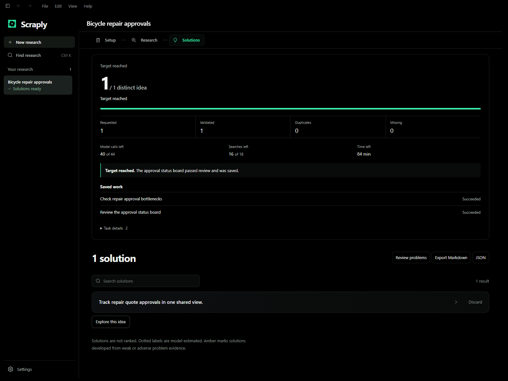

# Scraply

Scraply is a Windows desktop app for researching problems and developing ideas against the evidence. It keeps projects, source snapshots, ideas, analyses, and your decisions in a local SQLite database. You choose the research scope and model, review what the app found, and decide what to pursue.

**Status:** Scraply is in active development in a private repository. There is no public download yet. A green build or an installed test package is not a release.

_Example workflow using test data._

## Start a project

Scraply needs Windows 10 or 11, a connected OpenAI subscription account for its bundled native runtime, and an Exa or Perplexity API key for web research. Open the app, connect your account and search provider, then create a project. You can discover problems in a chosen scope or start with a problem you already know. Review the evidence and ideas before selecting one for deeper analysis.

The [user guide](docs/user-guide.md) walks through a project, model and research settings, saved results, and what partial or empty runs mean. [Data and privacy](docs/data-and-privacy.md) explains local storage, provider requests, credentials, backups, and exports. For startup or account errors, see [troubleshooting](docs/troubleshooting.md).

## Work on Scraply

Start with the [development guide](docs/development.md). It has the Windows and native prerequisites, setup commands, browser development workflow, isolated credentials, verification choices, and packaging handoff. See [CONTRIBUTING.md](CONTRIBUTING.md) for pull requests and issue routes, and [RELEASE.md](RELEASE.md) for release gates. The native worker has its own [runtime guide](runtime/README.md).

The project is not yet licensed for public reuse. A proposed MIT license awaits maintainer approval and ownership review in [docs/license-proposal.md](docs/license-proposal.md). Bundled runtime and upstream notices remain in their original locations.
