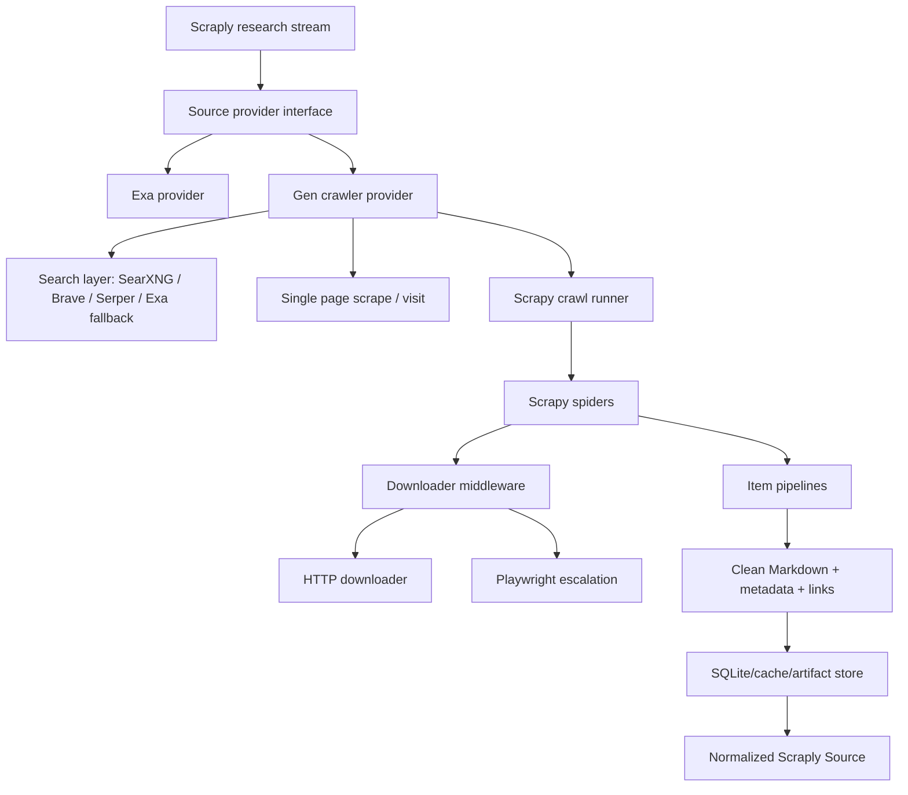

# Optimizing the Gen Crawler Around Scrapy

## Executive Summary

The crawler should not try to become a full Scrapy replacement. That is the wrong fight. Scrapy already has mature answers for scheduling, throttling, retries, downloader middleware, spider composition, link extraction, item pipelines, feed exports, and operational crawling patterns.

The better architecture is:

- Scrapy handles crawling infrastructure.
- The gen crawler handles agent-facing intent, source selection, extraction recipes, browser escalation decisions, and clean evidence output.
- Scraply consumes normalized sources, claims, and crawl artifacts without caring whether they came from Exa, SearXNG, Scrapy, Playwright, or a single-page scrape.

This turns the crawler from a fragile "Firecrawl clone" into a useful orchestration layer over proven crawling primitives.

## Core Position

The current crawler direction is valuable, but it has too much infrastructure surface area that Scrapy already solved better.

Keep:

- agent-friendly MCP/REST tools
- clean Markdown extraction
- search provider abstraction
- typed errors
- cache
- source normalization
- goal-directed page visiting
- browser escalation

Move to Scrapy or build on Scrapy:

- crawl frontier
- robots.txt handling
- per-domain delay
- concurrency
- retries
- downloader middleware
- spider lifecycle
- crawl persistence
- export formats
- link extraction
- item pipelines

Remove or de-emphasize:

- homegrown generic crawler loop
- homegrown broad crawl scheduling
- free proxy pool defaults
- "research loop" inside the crawler
- answer synthesis inside crawler search
- sandboxed Python execution

## Product Boundary

The crawler should answer this question:

> Given an agent's research intent, what web evidence can we reliably acquire, clean, structure, and return?

It should not answer:

> What should the final research conclusion be?

Scraply should own conclusions, synthesis, scoring, and ideas. The crawler should own acquisition and extraction.

## Proposed Architecture



## Responsibilities

### Scraply

Scraply should stay focused on:

- project intake
- research stream planning
- evidence-aware claim extraction
- report generation
- synthesis
- idea generation
- scoring
- persistence of research runs and ideas

Scraply should ask for sources through a simple provider interface:

```ts
interface SourceProvider {
  search(query: string, options: SearchOptions): Promise<Source[]>;
  visit?(url: string, goal: string, options?: VisitOptions): Promise<Source>;
  crawl?(seed: string, options: CrawlOptions): Promise<Source[]>;
}
```

### Gen Crawler

The gen crawler should provide:

- `search`
- `scrape`
- `visit`
- `crawl`
- `map`
- `extract`
- optional `crawl_job_status`
- optional `crawl_job_results`

It should return normalized evidence, not final conclusions.

### Scrapy

Scrapy should own:

- crawl scheduling
- request queueing
- duplicate filtering
- robots.txt
- retry/backoff
- AutoThrottle
- depth limits
- domain limits
- spider definitions
- item pipelines
- feed exports
- downloader middleware

## How To Synergize With Scrapy Properly

### 1. Treat Scrapy As The Crawl Runtime

Do not call Scrapy as a random subprocess for every page unless the crawl is tiny. Use Scrapy as the runtime for crawling jobs.

Recommended approach:

- keep FastAPI/MCP as the agent-facing API
- create a Scrapy project inside or beside the crawler repo
- expose a `CrawlJob` abstraction in the gen crawler
- enqueue crawl jobs from REST/MCP
- run Scrapy spiders through `CrawlerRunner` or a worker process
- write results to the crawler cache/artifact store

For simple one-page scraping, the gen crawler can still use its lightweight HTTP fetcher. For multi-page crawling, use Scrapy.

### 2. Build A Generic Intent Spider

Create one generic spider that accepts:

- seed URL
- max depth
- max pages
- include patterns
- exclude patterns
- allowed domains
- extraction mode
- content goal
- browser escalation policy

Example spider arguments:

```json
{
  "seed_url": "https://example.com/docs",
  "max_depth": 2,
  "max_pages": 100,
  "include_patterns": ["/docs"],
  "exclude_patterns": ["/login", "/pricing"],
  "goal": "Find evidence about API limits and pricing",
  "extract": "main_content",
  "browser_policy": "auto"
}
```

This keeps the agent API flexible without generating custom spider code for every task.

### 3. Use Scrapy Middleware For Fetch Policy

Move fetch behavior into downloader middleware:

- realistic headers
- user-agent rotation
- per-domain pacing
- retry classification
- blocked page detection
- browser escalation
- optional proxy selection
- response metadata

The gen crawler should decide policy. Scrapy should execute it.

Example policy modes:

- `fast`: HTTP only
- `auto`: HTTP first, browser only on blocked/empty/JS-heavy pages
- `browser`: force Playwright
- `conservative`: strict robots, slower delay, low concurrency

### 4. Use Scrapy-Playwright Instead Of A Parallel Browser Stack

If the crawler uses Scrapy for crawling, browser rendering should integrate through `scrapy-playwright`.

That avoids two separate crawling worlds:

- one HTTP/browser stack in custom code
- another HTTP/browser stack in Scrapy

Keep the current direct Playwright fetcher only for single-page `scrape` if it is simpler. For Scrapy crawls, use Scrapy middleware and `scrapy-playwright`.

### 5. Convert Scrapy Items Into Agent Sources

Scrapy should emit raw-ish crawl items. The gen crawler should normalize them.

Scrapy item:

```json
{
  "url": "...",
  "final_url": "...",
  "status_code": 200,
  "html": "...",
  "fetched_at": "...",
  "depth": 1,
  "headers": {},
  "links": []
}
```

Crawler normalized source:

```json
{
  "id": "source-1",
  "url": "...",
  "title": "...",
  "text": "Clean text or markdown",
  "content_markdown": "...",
  "publishedDate": "...",
  "author": "...",
  "meta": {
    "mode": "scrapy-http",
    "depth": 1,
    "tokens_est": 1200,
    "status": "ok"
  }
}
```

Scraply should consume the final normalized source.

### 6. Keep Extraction Outside Spider Logic

Do not bake LLM extraction into Scrapy spiders.

Better split:

- Scrapy fetches pages and metadata.
- Cleaner extracts main content.
- Optional extraction layer applies selectors, schema, or goal extraction.
- Scraply does claim extraction and synthesis.

This makes crawls reproducible and easier to test.

### 7. Add Crawl Job Storage

Scrapy jobs are longer-lived than a single `scrape` call. Add durable job state.

Tables:

- `crawl_jobs`
- `crawl_pages`
- `crawl_errors`
- `crawl_artifacts`

Minimum fields for `crawl_jobs`:

- `id`
- `status`
- `seed_url`
- `config_json`
- `created_at`
- `started_at`
- `finished_at`
- `pages_seen`
- `pages_saved`
- `error`

Minimum fields for `crawl_pages`:

- `id`
- `job_id`
- `url`
- `final_url`
- `title`
- `content_markdown`
- `text`
- `links_json`
- `meta_json`
- `created_at`

### 8. Add A Small Job API

Recommended endpoints/tools:

- `crawl_start`
- `crawl_status`
- `crawl_results`
- `crawl_cancel`
- `crawl_export`

Do not make agents wait on large crawls synchronously. Return a job ID.

For small crawls, allow synchronous mode:

```json
{
  "seed_url": "https://example.com",
  "max_pages": 10,
  "sync": true
}
```

For larger crawls:

```json
{
  "seed_url": "https://example.com",
  "max_pages": 500,
  "sync": false
}
```

## Implementation Phases

### Phase 1: Clarify Boundaries

Goal: stop the crawler from overlapping with Scraply and Scrapy.

Tasks:

- mark `research` as experimental or remove from public MCP/REST tools
- disable `execute_python` from MCP/REST
- set free proxies off by default
- define `SourceProvider` shape in Scraply
- define crawler normalized source schema
- document that the crawler returns evidence, not conclusions

Deliverable:

- Scraply can choose `exa`, `jankrawler`, or `hybrid` as source provider.

### Phase 2: Add Scrapy Project Skeleton

Goal: introduce Scrapy without replacing all existing fetch code.

Tasks:

- add Scrapy dependency
- add `scrapy.cfg`
- create `gen_crawler_scrapy/`
- create generic intent spider
- create item model
- create item pipeline that calls existing cleaner
- add settings for AutoThrottle, robots, concurrency, depth, retries

Deliverable:

- command-line crawl of one site produces normalized JSON/NDJSON sources.

### Phase 3: Bridge Scrapy To The Existing API

Goal: make Scrapy crawls usable through the existing agent interface.

Tasks:

- add `CrawlJobService`
- add job tables
- add `crawl_start`, `crawl_status`, `crawl_results`
- support sync mode for small crawls
- route existing `crawl` to Scrapy internally
- keep existing single-page `scrape` path for now

Deliverable:

- MCP/REST users can start and inspect Scrapy-backed crawls.

### Phase 4: Browser Escalation Through Scrapy

Goal: avoid maintaining two browser-crawl systems.

Tasks:

- add `scrapy-playwright`
- implement blocked/empty/JS-heavy detection middleware
- support `browser_policy`
- keep browser usage rare and explicit
- record fetch mode per page

Deliverable:

- JavaScript-heavy pages work in crawls without forcing every page through Chromium.

### Phase 5: Scraply Integration

Goal: make Scraply benefit from the crawler immediately.

Tasks:

- add `JankrawlerClient` in Scraply
- add source provider config
- map crawler results to `SourceSchema`
- support fallback: Exa first, crawler second
- support hybrid: Exa + crawler dedupe
- add tests using mocked crawler responses

Deliverable:

- Scraply research streams can use crawler-acquired sources.

### Phase 6: Quality Evaluation

Goal: prove this is better than vibes.

Tasks:

- create benchmark queries from real Scraply streams
- compare Exa vs crawler vs hybrid
- score source usefulness
- score source freshness
- score duplicate rate
- score extractable evidence rate
- track cost and latency

Deliverable:

- decision matrix showing when to use Exa, crawler, or hybrid.

## What To Remove From The Existing Crawler

Remove from the default public surface:

- `research`
- `execute_python`
- answer synthesis in `search`
- free proxy pool default
- broad custom crawler as the main crawl engine

Keep internally only if needed:

- direct HTTP fetcher
- direct Playwright fetcher for one-page scrape
- content cleaner
- search providers
- cache
- file parser
- goal-directed visit

## What To Add

Add:

- Scrapy-backed crawl runtime
- generic intent spider
- Scrapy item pipeline for content cleaning
- Scrapy downloader middleware for browser escalation
- crawl job persistence
- normalized source schema shared with Scraply
- source provider adapter in Scraply
- hybrid source selection
- benchmark suite against real Scraply stream needs

## Recommended Dependencies

Crawler repo:

```toml
scrapy = ">=2.11"
scrapy-playwright = ">=0.0.34"
```

Optional later:

```toml
scrapyd = ">=1.5"
```

Use Scrapyd only if you need a persistent crawl daemon. Do not introduce it on day one unless job isolation becomes painful.

## Configuration Defaults

Recommended defaults:

```env
JANKRAWLER_CRAWL_ENGINE=scrapy
JANKRAWLER_RESPECT_ROBOTS=true
JANKRAWLER_USE_FREE_PROXIES=false
JANKRAWLER_BROWSER_ENABLED=true
JANKRAWLER_BROWSER_POLICY=auto
JANKRAWLER_DEFAULT_CRAWL_DEPTH=2
JANKRAWLER_DEFAULT_CRAWL_MAX_PAGES=50
JANKRAWLER_CONCURRENT_REQUESTS=8
JANKRAWLER_AUTOTHROTTLE_ENABLED=true
```

For Scraply:

```env
SCRAPLY_SOURCE_PROVIDER=hybrid
SCRAPLY_JANKRAWLER_BASE_URL=http://127.0.0.1:8765
SCRAPLY_EXA_FALLBACK=true
```

## Design Rules

1. Do not generate custom spider code unless there is a repeated site-specific need.
2. Keep crawls evidence-focused, not answer-focused.
3. Browser rendering is a fallback, not the default.
4. Scrapy owns crawl mechanics.
5. The gen crawler owns agent ergonomics.
6. Scraply owns synthesis and ideas.
7. Every source must have provenance.
8. Every failure should be typed and useful.
9. Caches should be visible and invalidatable.
10. Benchmarks decide provider defaults.

## Risks

### Risk: Scrapy Adds Complexity

Scrapy is worth it only for multi-page crawls. If the product only needs search plus single-page scrape, Scrapy may be overkill.

Mitigation:

- keep direct `scrape` path
- introduce Scrapy only for `crawl`
- do not force every fetch through Scrapy

### Risk: Two Fetch Stacks Drift Apart

Direct fetch and Scrapy fetch may behave differently.

Mitigation:

- share cleaner
- share error taxonomy
- share normalized source schema
- share browser policy names
- write compatibility tests

### Risk: Browser Crawling Gets Expensive

Chromium per page is slow and memory-heavy.

Mitigation:

- auto-escalate only on detected need
- cap browser pages per crawl
- expose browser usage metrics
- default to HTTP

### Risk: The Tool Becomes A Research Product Itself

That dilutes Scraply.

Mitigation:

- remove crawler-side research synthesis from the default interface
- keep crawler output as evidence
- keep Scraply as the research product

## Definition Of Done

The integration is working when:

- Scraply can run a stream using Exa, crawler, or hybrid sources.
- The crawler can run a Scrapy-backed crawl through REST/MCP.
- A crawl returns normalized sources with clean text, title, URL, metadata, and typed errors.
- Browser escalation works inside Scrapy crawls but is not used for every page.
- The old custom crawl loop is no longer the main multi-page crawling path.
- Benchmarks show when crawler/hybrid is better or cheaper than Exa.

## Final Recommendation

Use Scrapy, but use it in the right place.

Do not turn the gen crawler into a half-Scrapy clone. That creates maintenance pain with no upside. Let Scrapy handle crawling infrastructure. Keep the gen crawler as the agent-facing acquisition layer. Keep Scraply as the research and idea engine.

That split is clean, realistic, and much more likely to survive real usage.
